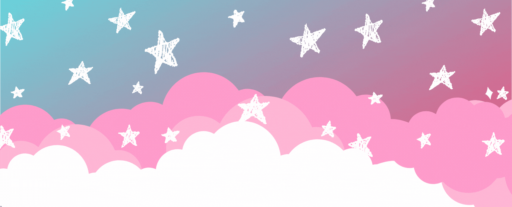

  

 
  

 
  
  
  
  

 

## About Me 💭
 
  
Hi! My name is Isabel, but you can call me Bel. I have a degree in Chemistry, but I strayed from the area and switched to technology. I am currently a student of Front-End Development, learning HTML5, CSS and JavaScript. 

## Language Stack ✨
 

  
  
  

## GitHub Status 🌈
 

  <a href="https://github.com/belqraposo">
  
  

  
  ##
  

 
